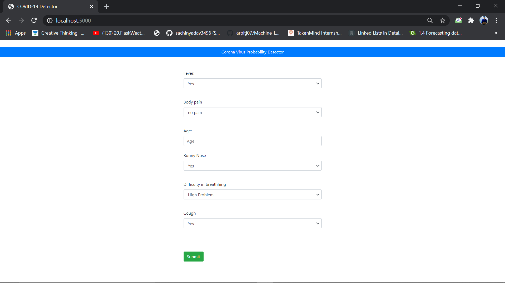
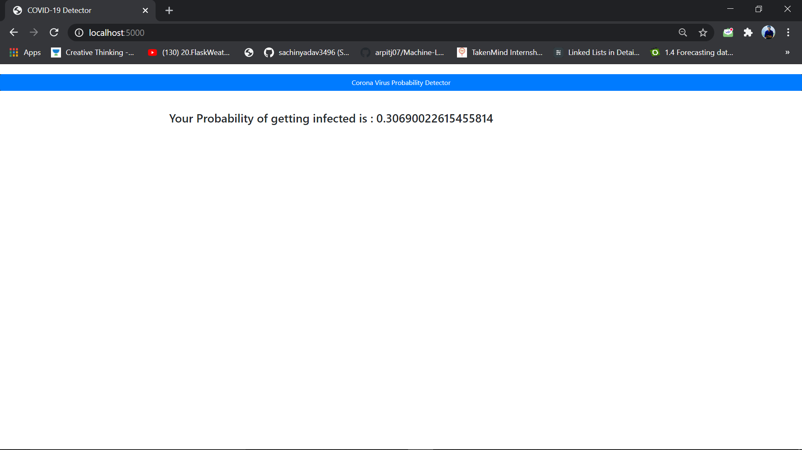

# COVID-19-Detector-using-MachineLearning-and-Flask
+ Usages `python main.py`

In this project , it will detect corona virus Probability in terms of some features . the data is not real. its a dummy data that i have generated for learning purpose. Add you own data and train over that while using this application . 

